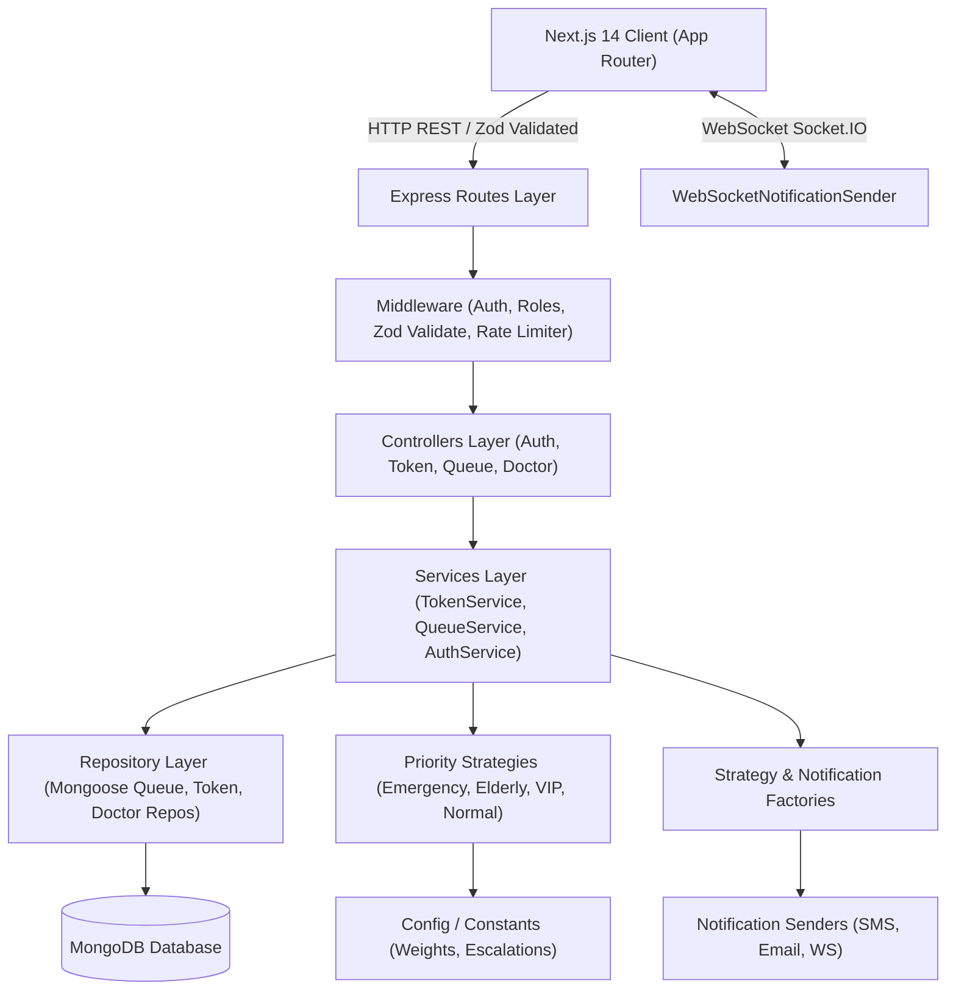

# NEXLINE — Smart Queue Management System

**NEXLINE** is a production-ready, fintech-grade Hospital Queue Management System built with **Express.js**, **MongoDB**, **Socket.IO**, and **Next.js (App Router)**.

---

## 🎯 Architecture Diagram (SOLID Principles)



---

## 🌟 Key Overhaul Highlights

1. **Strict S-O-L-I-D Architecture**:
   - **Single Responsibility (S)**: Decoupled Controller → Service → Repository → Validator layers.
   - **Open/Closed (O)**: Strategy pattern for Queue Priority (`EmergencyQueueStrategy`, `ElderlyQueueStrategy`, `VipQueueStrategy`, `NormalQueueStrategy`).
   - **Liskov Substitution (L)**: `IQueueStrategy`, `INotificationSender`, and `IQueueRepository` contract abstractions.
   - **Interface Segregation (I)**: Granular, focused repository contracts.
   - **Dependency Inversion (D)**: Services utilize Constructor Dependency Injection.

2. **Complete Inventory Module Removal**:
   - Cleaned up all inventory routes, models, store actions, mock data, and navigation links across the codebase.

3. **NEXLINE Fintech-Medical Identity**:
   - **Primary**: Deep Medical Blue (`#0A2463`)
   - **Accent**: Electric Cyan (`#00D4FF`)
   - **Success**: Emerald (`#10B981`)
   - **Emergency**: Crimson (`#EF4444`)
   - **Background**: Dark Navy (`#070F2B`) with ambient mesh gradient & glassmorphism backdrop blurs.

4. **Queue Intelligence & Features**:
   - **Priority Scoring Formula**:
     $$\text{Priority Score} = \text{Base Weight} + (\text{Wait Time} \times 1.5) + \text{Emergency Bonus (100)} + \text{Age Factor (20)}$$
   - **Human-Readable Tokens**: `CARD-042`, `EMG-003`, `OPD-118` format with SVG QR code generation for digital token status tracking.
   - **1-Click Emergency Bump**: Instantly escalate urgent cases to top of queue.
   - **Prominent Doctor Portal**: 1-Click **"CALL NEXT PATIENT"**, live consultation timer, and target progress ring.
   - **Standalone TV / Kiosk Display Board (`/display`)**: High-contrast airport departure board waiting hall kiosk.
   - **Twilio SMS Notification Subsystem**: Automated SMS notifications when patient is 2 tokens away.

---

## 📁 Repository Folder Structure

```
hospital/
├── server/
│   └── src/
│       ├── config/         # Environment, DB & System Constants
│       ├── controllers/    # Request/Response handlers
│       ├── factories/      # QueueStrategyFactory, NotificationSenderFactory
│       ├── interfaces/     # SOLID Contracts (IQueueRepository, IQueueStrategy)
│       ├── middleware/     # JWT Auth, Roles Guard, Zod Validate, ErrorHandler
│       ├── models/         # Mongoose Schemas (User, Department, Doctor, Queue, Token)
│       ├── repositories/   # Mongoose Data Access Repositories
│       ├── routes/         # Express REST API Endpoints
│       ├── senders/        # SMS, Email, WebSocket Notification Senders
│       ├── services/       # Domain Business Logic with Dependency Injection
│       ├── sockets/        # Socket.IO Queue Event Handlers
│       ├── strategies/     # Priority Calculation Strategy Classes
│       ├── validators/     # Zod Schemas for API Requests
│       └── utils/          # Standard Response Formatter & Logger
└── client/
    └── src/
        ├── app/
        │   ├── admin/       # Trading-Terminal Admin Dashboard & Heatmap
        │   ├── doctor/      # Prominent Doctor Portal & Call Next Control
        │   ├── receptionist/# Quick Intake & 1-Click Emergency Bump
        │   ├── patient/     # Airport Board Token Tracker & SMS Opt-in
        │   ├── display/     # Standalone Waiting Area TV Display Board
        │   ├── layout.jsx
        │   └── page.jsx     # NEXLINE Hero Landing & Role Auth Portal
        ├── components/      # PulseLogo, ConfirmModal, SkeletonLoader, QRCode
        ├── lib/             # Mock Data & Socket API Client
        └── store/           # Zustand Store (useHospitalStore, useAuthStore)
```

---

## 🧪 Running Verification & Tests

```bash
# Run server backend unit tests
cd server
npm test

# Launch development servers
# Server on port 5000 | Client on port 3000
npm run dev
```
